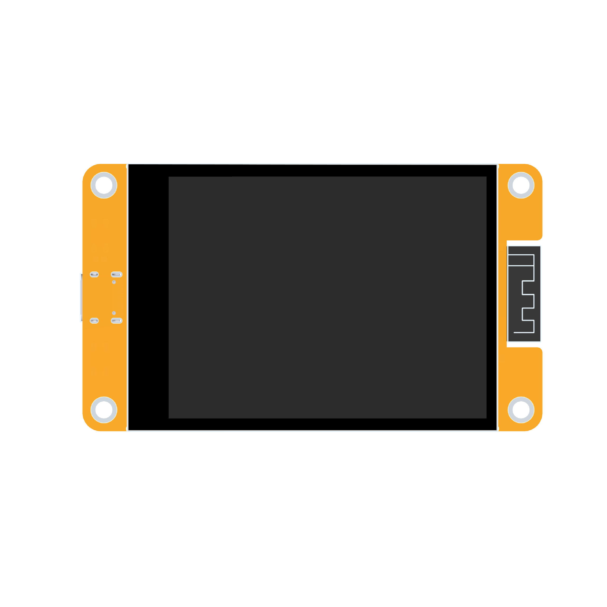
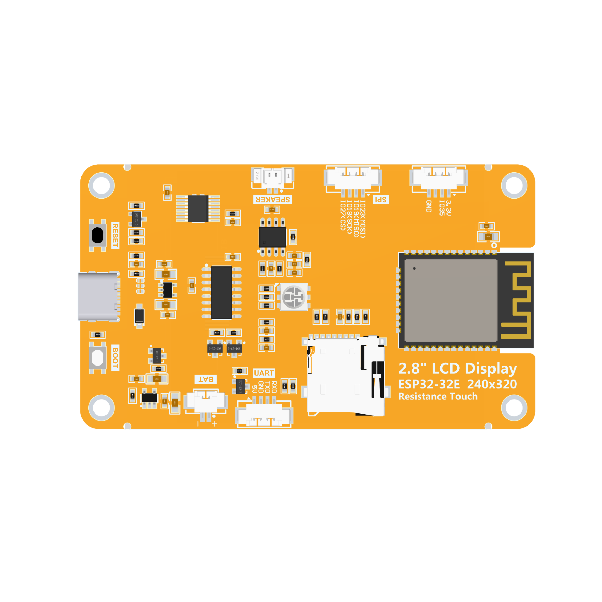
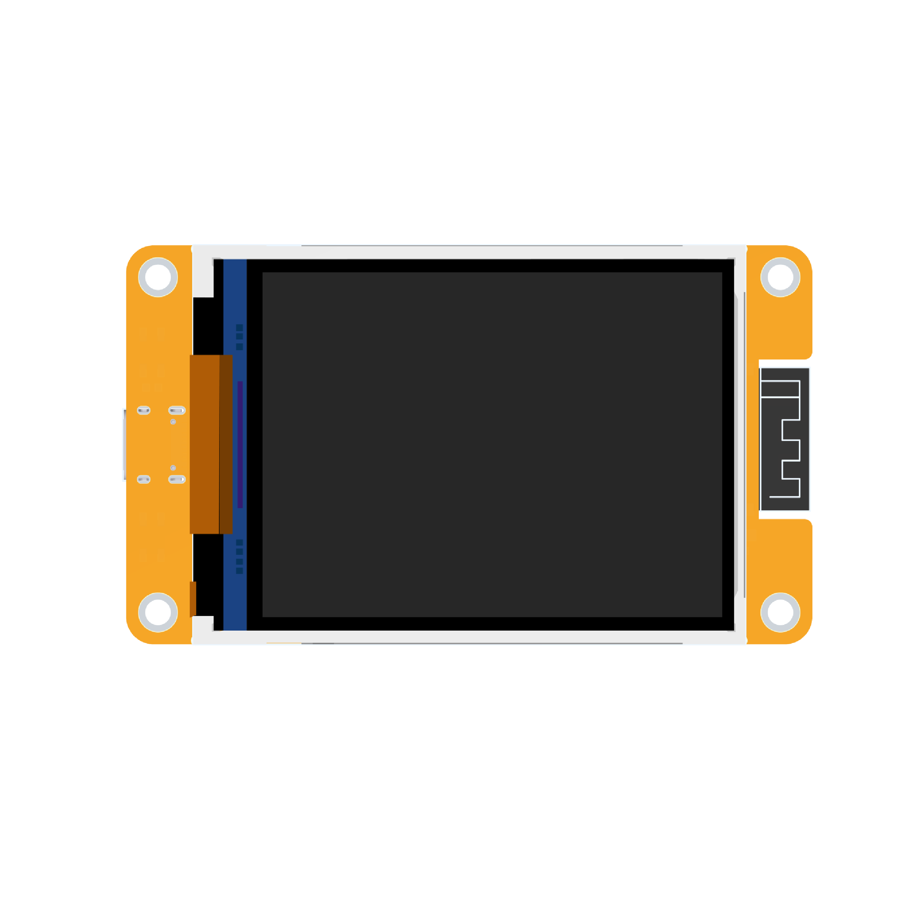

# 2.8inch ESP32-32E Display

# 产品图片

E32R28T-TopView

E32R28T-BottomView

E32N28T-TopView

   

E32N28T--BottomView

-   

# 产品介绍

-   自带ESP32-32E模组，开发方便，开发资源充足
-   2.8寸彩屏，240x320分辨率，最大支持262K色（RGB666）,显示色彩丰富
-   接口丰富，方便连接各种外设（SPI、UART等外设）
-   支持外接喇叭，播放音频
-   自带RGB三色指示灯，指示状态丰富
-   自带电阻触摸屏，方便人机交互
-   标准的TYPE-C接口，方便程序下载和供电
-   自带micro TF卡槽，方便扩展存储
-   支持外接锂电池，轻巧便携
-   自带电池充电管理电路，可确保电池安全充放电
-   提供丰富的示例程序，方便学习
-   提供底层驱动技术支持,WIKI资料在线更新
-   模块老化测试多重检测可达军工级标准，支持长期稳定工作

# 产品参数

## ESP32主控参数

| **名称**     | **参数**                                             |
|--------------|------------------------------------------------------|
| **模组**     | ESP32-32E                                            |
| **CPU**      | ESP32-D0WD-V3,Xtensa双核32位LX6 微处理器             |
| **主频**     | 240MHz（最大）                                       |
| **存储**     | 448KB ROM+520KB SRAM+16KB RTC SRAM+4MB外接QSPI Flash |
| **WIFI**     | 2.4GHz、802.11b/g/n模式                              |
| **蓝牙**     | 蓝牙 V4.2 BR/EDR 和蓝牙LE标准                        |
| **工作电压** | 3.0\~3.6(V)                                          |
| **工作温度** | –40\~85(℃)                                           |

## 液晶屏参数

| **名称**             | **参数**                             |
|----------------------|--------------------------------------|
| **屏幕尺寸**         | 2.8 inch                             |
| **屏幕类型**         | TN TFT                               |
| **分辨率**           | 240xRGBx320(pixels)                  |
| **有效显示区**       | 43.20(W)x57.60(H)(mm)                |
| **颜色数目**         | 最大：262K(RGB666) 常用：65K(RGB565) |
| **驱动IC**           | ILI9341V                             |
| **显示接口**         | 4-Line SPI(接到ESP32上)              |
| **像素尺寸**         | 0.153(H)x0.153(mm)                   |
| **可视角度**         | 12 0’CLOCK                           |
| **背光亮度(典型值)** | 260 cd/m2                            |
| **背光灯类型**       | White LED\*4                         |
| **工作温度**         | -10\~50(℃)                           |
| **存储温度**         | -20\~60(℃)                           |

## 触摸屏参数

| **名称**         | **参数**              |
|------------------|-----------------------|
| **有效区尺寸**   | 2.8 inch              |
| **触摸屏类型**   | 电阻触摸屏            |
| **触摸屏分辨率** | 240x320(pixels)       |
| **驱动IC**       | XPT2046               |
| **可视窗口尺寸** | 45.20(W)x59.45(H)(mm) |
| **通信接口**     | SPI                   |
| **结构材质**     | ITO膜+ITO玻璃         |
| **工作温度**     | -10\~60(℃)            |
| **存储温度**     | -20\~70(℃)            |

## 尺寸参数

| **名称**           | **参数**                                                                        |
|--------------------|---------------------------------------------------------------------------------|
| **液晶屏外形尺寸** | 50.00±0.2(W)x69.20±0.2(H)x2.3±0.1(D)(mm)(不含排线和背胶)                        |
| **触摸屏外形尺寸** | 49.60±0.2(W)x68.80±0.2(H)x1.20 (D)(mm)(不含排线和背胶)                          |
| **模块外形尺寸**   | 有触摸屏：50.00(W)x86.00(H)x5.60(D)(mm) 无触摸屏：50.00(W)x86.00(H)x4.40(D)(mm) |

## 电池充电参数

| **名称**         | **参数**                        |
|------------------|---------------------------------|
| **充电电压**     | 范围：4.2\~6.5(V) 典型值：5V    |
| **充电电流**     | 最大值：500mA 模块实际值：290mA |
| **充电饱和电压** | 4.24V                           |
| **充电温度**     | 模块实际最大值：62℃             |
| **充电电池规格** | 3.7V聚合锂电池                  |

## 电气参数

| **名称**     | **参数**                                                                  |
|--------------|---------------------------------------------------------------------------|
| **工作电压** | 5.0V                                                                      |
| **背光电流** | 75mA                                                                      |
| **总电流**   | ESP32复位：40mA 只有显示屏工作：130mA 显示屏、喇叭、电池充电都工作：480mA |
| **功耗**     | 0.65W（只有显示屏工作）                                                   |

## 基本参数

| **名称**             | **参数**                            |
|----------------------|-------------------------------------|
| **SKU**              | 有触摸屏：E32R28T 无触摸屏：E32N28T |
| **供电接口**         | TYPE-C                              |
| **重量（包含包装）** | E32R28T: 90g E32N28T:80g            |

# 接口定义

## 接口功能说明

| **接口**          | **功能说明**                                                                                                                                                                                                 |
|-------------------|--------------------------------------------------------------------------------------------------------------------------------------------------------------------------------------------------------------|
| **ESP32-32E模组** | 显示模块主控，控制板载外设和外接外设。                                                                                                                                                                       |
| **MicroSD卡槽**   | 插入Micro SD卡，用来扩展存储空间，例如存放字库、图片、音频文件等大数据内容。                                                                                                                                 |
| **RGB三色灯**     | 包含红、绿、蓝三种颜色的LED灯，每种灯都可由IO控制，用来指示状态。                                                                                                                                            |
| **串口**          | 1.25mm 4P座子。可用于串口调试、下载以及通信。需外接USB转串口模块。                                                                                                                                           |
| **电池接口**      | 1.25mm 2P座子，用于接入3.7V聚合锂电池， 通过电池充电管理电路对电池进行充电，也可用于电池供电。 注意接口正、负极。                                                                                            |
| **BOOT按键**      | 用于进入下载模式或者按键测试。 按住此按键上电，然后松开可进入下载模式， 或者上电后，按住此按键，再按RESET键， 松开RESET键后，再松开此按键，也可以进下载模式。 不需要进入下载模式时，此按键可做普通按键使用。 |
| **TYPE-C接口**    | 用于模块供电和下载程序。此接口和模块上的一键下载电路相连， 可实现自动进入下载模式（无需按BOOT键）。                                                                                                          |
| **RESET按键**     | 用于ESP32主控以及LCD复位，按下后电平复位。                                                                                                                                                                   |
| **扩展输入引脚**  | 1.25mm 4P座子。引出GND、3.3V、IO35三个引脚， 其中IO35只能做输入引脚使用。                                                                                                                                    |
| **喇叭接口**      | 1.25mm 2P座子。用于接入喇叭播放音频。                                                                                                                                                                        |
| **SPI外设接口**   | 1.25mm 4P座子。用于外接SPI通信设备， 此SPI接口和MicroSD共用。可做普通IO使用。                                                                                                                                |

## ESP32引脚分配

| **板载设备**   | **ESP32连接引脚** | **板载设备引脚说明**                                                                            |
|----------------|-------------------|-------------------------------------------------------------------------------------------------|
| **液晶屏**     | IO15              | 液晶屏片选控制信号，低电平有效                                                                  |
|                | IO2               | 液晶屏命令/数据选择控制信号 高电平：数据，低电平：命令                                          |
|                | IO14              | 液晶屏SPI总线时钟信号                                                                           |
|                | IO13              | 液晶屏SPI总线写数据信号                                                                         |
|                | IO12              | 液晶屏SPI总线读数据信号                                                                         |
|                | EN                | 液晶屏复位控制信号，低电平复位（和ESP32-32E主控共用复位引脚）                                   |
|                | IO21              | 液晶屏背光控制信号（高电平点亮背光，低电平关闭背光）                                            |
| **电阻触摸屏** | IO25              | 电阻触摸屏SPI总线时钟信号                                                                       |
|                | IO32              | 电阻触摸屏SPI总线写数据信号                                                                     |
|                | IO39              | 电阻触摸屏SPI总线读数据信号                                                                     |
|                | IO33              | 电阻触摸屏片选控制信号，低电平有效                                                              |
|                | IO36              | 电阻触摸屏触摸中断信号，产生触摸时，输入低电平到主控                                            |
| **RGB三色灯**  | IO22              | 红色LED灯（共阳极，低电平点亮，高电平关闭）                                                     |
|                | IO16              | 绿色LED灯（共阳极，低电平点亮，高电平关闭）                                                     |
|                | IO17              | 蓝色LED灯（共阳极，低电平点亮，高电平关闭）                                                     |
| **MicroSD 卡** | IO5               | SD卡片选信号，低电平有效                                                                        |
|                | IO23              | SD卡SPI总线写数据信号（MicroSD 卡和SPI外设共用）                                                |
|                | IO18              | SD卡SPI总线时钟信号（MicroSD 卡和SPI外设共用）                                                  |
|                | IO19              | SD卡SPI总线读数据信号（MicroSD 卡和SPI外设共用）                                                |
| **音频**       | IO4               | 音频使能信号，低电平使能，高电平禁止                                                            |
|                | IO26              | 音频信号DAC输出信号                                                                             |
| **按键**       | IO0               | 下载模式选择按键（按住该按键上电，然后松开就会进入下载模式）                                    |
|                | EN                | ESP32-23E复位按键，低电平复位（和液晶屏复位共用）                                               |
| **串口**       | RXD0(IO3)         | ESP32-32E串口接收信号（如果不使用串口，可做普通IO使用）                                         |
|                | TXD0(IO1)         | ESP32-32E串口发送信号（如果不使用串口，可做普通IO使用）                                         |
| **电池**       | IO34              | 电池电压ADC值获取信号（输入）                                                                   |
| **SPI外设**    | IO27              | SPI外设片选信号，低电平有效 （如果不使用SPI设备，可做普通IO使用）                               |
|                | IO18              | SPI外设的SPI总线时钟引脚 （SPI外设和MicroSD 卡共用，如不使用SPI设备或者SD卡，可做普通IO使用）   |
|                | IO19              | SPI外设的SPI总线读数据引脚 （SPI外设和MicroSD 卡共用，如不使用SPI设备或者SD卡，可做普通IO使用） |
|                | IO23              | SPI外设的SPI总线写数据引脚 （SPI外设和MicroSD 卡共用，如不使用SPI设备或者SD卡，可做普通IO使用） |
| **未使用**     | IO35              | 只能做输入IO使用                                                                                |

# 快速使用说明

 [**2.8寸ESP32-32E显示模块快速使用资料包**](http://www.lcdwiki.com/res/E32R28T/2.8inch_ESP32-32E_E32R28T_E32N28T_Quick_Start.zip)

 [**2.8寸ESP32-32E显示模块快速使用说明**](http://www.lcdwiki.com/zh/ESP32-32E%E6%98%BE%E7%A4%BA%E6%A8%A1%E5%9D%97%E5%BF%AB%E9%80%9F%E4%BD%BF%E7%94%A8)

# 资料包下载

 [**2.8寸ESP32-32E显示模块资料包(提取码：4s6k)**](https://pan.baidu.com/s/11318Ul_pkI4VLVG55H_Rxg?pwd=4s6k)

